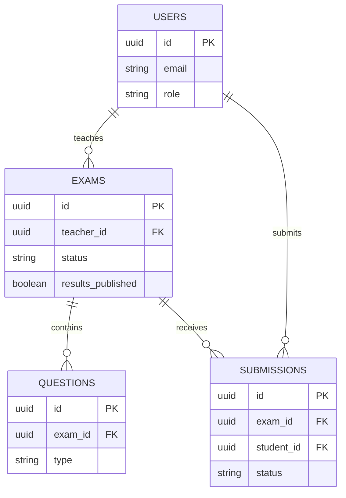

# Exam Management System

Full Stack Exam Management System for lecturers and students.

## Project Goal

Build a course-ready Exam Management System where:

- Lecturers can create/manage exams, publish, review submissions, and grade.
- Students can log in, view exams, submit answers, and view results/feedback.
- Frontend uses React and connects to a real JWT API (with mock fallback during development).

## Repository Structure

- `client/` - React + Vite frontend
- `services/` - backend microservices + API gateway
  - `gateway/` - public entrypoint (proxies to auth/exams/submissions)
  - `auth/` - register, login, `/me`
  - `exams/` - exam CRUD and catalogue
  - `submissions/` - submit, grade, results
- `packages/common/` - shared DB pool, JWT auth, config
- `tools/database/` - schema, seed, connectivity, and diagnostic scripts
- `docs/` - contracts and integration notes
- `diagrams/` - architecture and ERD diagrams
- `docker-compose.yml` - local client + gateway + microservices (Supabase stays hosted)
- `.env.example` - env template for Docker Compose

## Tech Stack

- Frontend: React, Vite, JavaScript
- API integration: custom `ApiService` with JWT bearer token
- Local fallback: `MockApiService` + browser localStorage
- Backend API contract: `docs/api-contract.md`

## Frontend Setup

### 1) Install dependencies

```bash
cd client
npm install
```

### 2) Configure environment

Create `.env` in `client/` (or copy from `.env.example`):

```env
VITE_API_URL=http://localhost:3000
VITE_USE_MOCK_API=true
```

- Set `VITE_USE_MOCK_API=true` to use local mock data.
- Set `VITE_USE_MOCK_API=false` to use real backend API endpoints.

### 3) Run frontend

```bash
cd client
npm run dev
```

Frontend default dev URL: `http://localhost:5173`

## API Integration Notes

- Base API URL comes from `VITE_API_URL` (default: `http://localhost:3000`).
- JWT token is stored via `StorageService` and attached as:
  `Authorization: Bearer <token>`
- API contract source of truth: `docs/api-contract.md`
- Role mapping is aligned as:
  - frontend `teacher` <-> API `teacher`
  - frontend `student` <-> API `student`

## Current Frontend Progress

### Completed

- [x] API client layer (`ApiService`) with consistent error handling
- [x] Auth wired to API (`/api/auth/login`, `/api/auth/register`, `/api/auth/me`)
- [x] Exam service wired to API (`/api/exams/*`) with mock fallback
- [x] Submission service wired to API (`/api/submissions/*`) with mock fallback
- [x] Teacher submissions review page (`/teacher/exam-submissions/:id`)
- [x] Question type selector in `ExamForm` (`MULTIPLE_CHOICE`, `OPEN_ENDED`)
- [x] `TakeExamPage` question-type rendering + countdown timer

### Remaining / In Progress

- [ ] Manual grading + feedback UI for open-ended answers
- [ ] Show lecturer feedback in student results page
- [ ] Unified loading and error states across all API pages
- [ ] Restore/create `docs/frontend-integration.md`
- [ ] Add `diagrams/` mermaid architecture and ERD

## Demo Accounts

Demo accounts depend on backend seed data when API mode is enabled.

- If using mock mode, register accounts directly from the app.
- If using API mode, use backend-provided seeded users (see backend/docs).

## Git Workflow

- Base branch: `dev`
- Create one feature branch per feature:
  - `feature/frontend-<task>`
- Open small PRs to `dev` (not `main`)
- Keep commits focused and reviewable (one feature per commit)

## Docker (local)

Runs the **client** (nginx), **API gateway**, and **auth / exams / submissions** microservices. The database stays on **hosted Supabase** — Compose does not start Postgres.

```text
Browser → client(:8080) → gateway(:3000) → auth | exams | submissions → Supabase
```

### 1) Create root `.env`

```bash
cp .env.example .env
```

Fill in your Supabase `DATABASE_URL`, `JWT_SECRET`, and related vars. See `.env.example` for the full list.

### 2) Start the stack

```bash
docker compose up --build
```

- App UI: `http://localhost:8080`
- API gateway: `http://localhost:3000` (health: `GET /api/health`)

Stop with `Ctrl+C` or `docker compose down`.

You can still use `npm run dev` in `client/` and each folder under `services/`
for day-to-day development without Docker.

## Deployment

### Live application

| Component | URL |
|-----------|-----|
| Frontend (Vercel) | https://exam-app-project-woad.vercel.app |
| API gateway (Render) | https://examapp-project.onrender.com |
| Gateway health | https://examapp-project.onrender.com/api/health |
| Auth service | https://exam-app-auth.onrender.com |
| Exams service | https://exam-app-exams.onrender.com |
| Submissions service | https://exam-app-submissions.onrender.com |

Render Free services sleep after inactivity, so the first request can take up
to about 50 seconds while a service starts.

| Platform | What | Docker? |
|----------|------|---------|
| **Vercel** | Frontend (`client/`) | No — native Vite build |
| **Render** | Gateway + 3 microservices | Yes — one Web Service per Dockerfile under `services/` |
| **Supabase** | Postgres | Outside Docker |

### Vercel (client)

- Root directory: `client`
- Build command: `npm run build`
- Output directory: `dist`
- Env: `VITE_API_URL` = your **gateway** Render URL; `VITE_USE_MOCK_API=false`

### Render (microservices)

Create **four** Docker Web Services (same GitHub repo, branch `dev`):

| Service | Dockerfile Path | Default port |
|---------|-----------------|--------------|
| gateway (public API URL) | `services/gateway/Dockerfile` | 3000 |
| auth | `services/auth/Dockerfile` | 3001 |
| exams | `services/exams/Dockerfile` | 3002 |
| submissions | `services/submissions/Dockerfile` | 3003 |

Dockerfiles expect build context = **repository root**. On Render set **Docker Build Context Directory** to `.` and **Dockerfile Path** as above.

Env for auth / exams / submissions: `DATABASE_URL`, `DATABASE_SSL=true`, `JWT_SECRET`, `CORS_ORIGIN` (Vercel URL), `NODE_ENV=production`, plus matching `PORT`.

Env for gateway: `CORS_ORIGIN`, `AUTH_SERVICE_URL`, `EXAMS_SERVICE_URL`, `SUBMISSIONS_SERVICE_URL`, `NODE_ENV=production`.

Keep Vercel `VITE_API_URL` pointed at the **gateway** so the frontend does not change.

## Database tools

Install and check the hosted database:

```bash
npm install --prefix tools/database
npm run check --prefix tools/database
```

Other commands:

```bash
npm run test --prefix tools/database
npm run seed --prefix tools/database
```

The seed command is destructive: it drops all application tables, recreates the
schema, and inserts demo data. Never run it against production unless a full
database reset is intentional.

## System Components

High-level responsibilities (see **Repository Structure** for folder paths).

| Component | Responsibility |
|-----------|----------------|
| React client | UI for teachers and students; talks to the API gateway with JWT, or uses the local mock API |
| API gateway | Public API entrypoint; proxies auth, exams, and submissions traffic |
| Auth service | Register, login, and current-user (`/me`) |
| Exams service | Exam CRUD, status changes, publish results, student catalogue |
| Submissions service | Submit answers, grade, and fetch results/submissions |
| `@exam-app/common` | Shared Postgres pool, JWT helpers, and auth/error middleware |
| `tools/database` | Schema, seed, migrations, and DB diagnostics against hosted Supabase |

Request flow: **Browser → client → gateway → auth / exams / submissions → Supabase**.

## Client Dependencies

Important packages from `client/package.json` that the frontend actually uses:

| Package | Used for |
|---------|----------|
| `react` / `react-dom` | UI and DOM rendering |
| `vite` | Dev server and production build |
| `@vitejs/plugin-react` | React support in Vite |
| `eslint` (+ React plugins) | Linting via `npm run lint` |

## Server Dependencies

Important packages used by the gateway, microservices, shared package, and DB tools:

| Package | Used for |
|---------|----------|
| `express` | HTTP servers and routes |
| `cors` | Cross-origin access from the client |
| `dotenv` | Loading environment variables |
| `http-proxy-middleware` | Gateway proxying to microservices |
| `pg` | PostgreSQL access (`packages/common`, `tools/database`) |
| `jsonwebtoken` | Signing and verifying JWTs |
| `bcrypt` | Password hashing in the auth service |
| `@exam-app/common` | Shared config, DB pool, JWT auth, and errors (auth/exams/submissions) |

## Database Schema Overview

Source: `tools/database/schema.sql`.

| Table | Purpose | Relationships |
|-------|---------|----------------|
| `users` | Teachers and students (role, credentials) | Referenced by exams and submissions |
| `exams` | Exam metadata, schedule, status, `results_published` | Belongs to a teacher (`teacher_id` → `users`) |
| `questions` | Multiple-choice or open-ended items for an exam | Belongs to an exam (`exam_id` → `exams`) |
| `submissions` | One attempt per student per exam (answers, score, feedback) | Belongs to exam + student; unique on `(exam_id, student_id)` |

## ERD

Based on `tools/database/schema.sql`.



## Notes for New Developers

- **Seeded users** (after `npm run seed --prefix tools/database`): `teacher@example.com` / `teacher123`, `student@example.com` / `student123`.
- **Default ports:** gateway `3000`, auth `3001`, exams `3002`, submissions `3003`, Vite client `5173`, Docker client UI `8080`.
- **Further reading:** `docs/api-contract.md`, `docs/frontend-integration.md`, `diagrams/README.md`.

## Documentation

- **API / JSON models:** [docs/api-contract.md](docs/api-contract.md)
- **OOP class diagram (frontend):** [diagrams/oop-class-diagram.mmd](diagrams/oop-class-diagram.mmd)
- **Sequence diagrams (API mode):**
  - [Login and JWT authentication](diagrams/sequence-login-jwt.mmd)
  - [Create and publish exam](diagrams/sequence-create-publish-exam.mmd)
  - [Submit, grade, and publish results](diagrams/sequence-submit-grade-publish.mmd)
- **Project milestones:** [docs/milestones.md](docs/milestones.md)

## Repository

- **GitHub:** https://github.com/MayaZahwy/ExamApp_Project
- **Live app URLs:** see **Deployment** above

## Features, Pages, and API

- **API endpoints / JSON models:** [docs/api-contract.md](docs/api-contract.md)
- **Frontend ↔ API wiring:** [docs/frontend-integration.md](docs/frontend-integration.md)
- **Client component hierarchy (pages and routes):** [diagrams/components-hierarchy.txt](diagrams/components-hierarchy.txt)

## Logging

- **Client:** `LoggerService` (`client/src/services/LoggerService.js`) writes console logs and is used by `NotifyService`.
- **Backend:** `console` logging for DB connectivity (`packages/common/src/db.js`) and error handling (`packages/common/src/middleware/errorHandler.js`).
